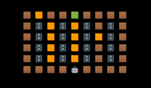
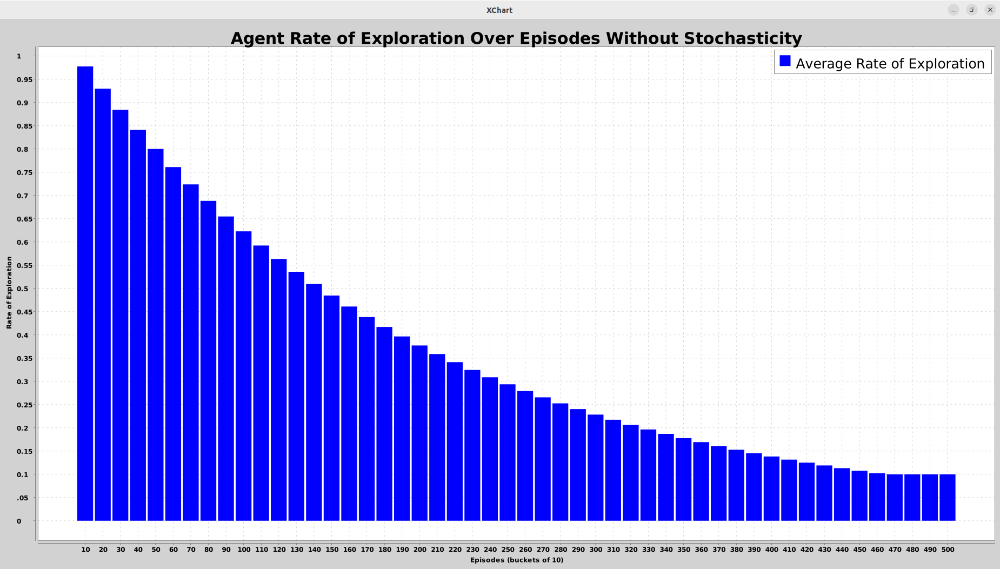
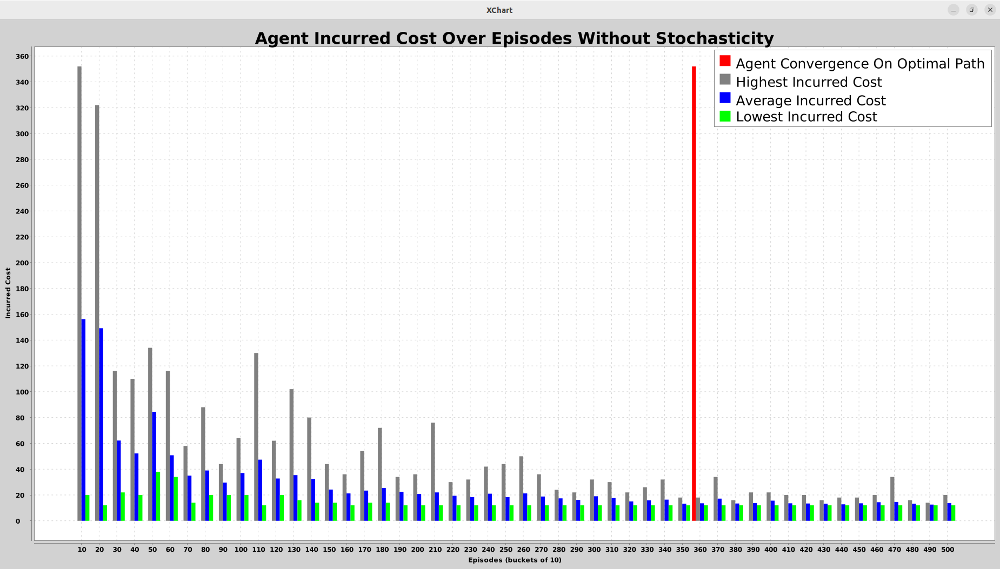
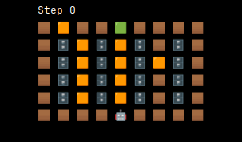
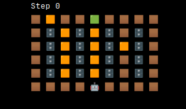
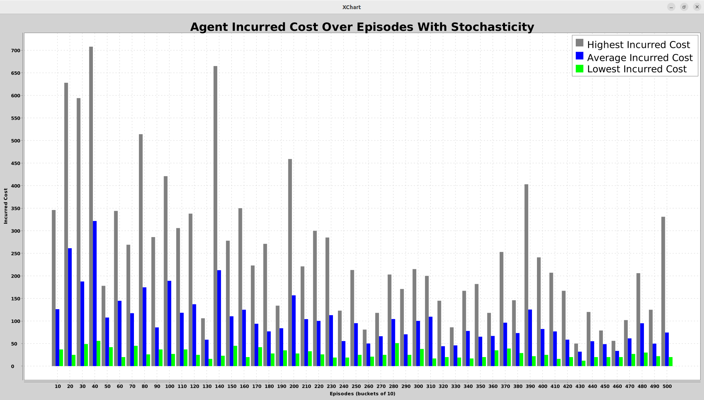
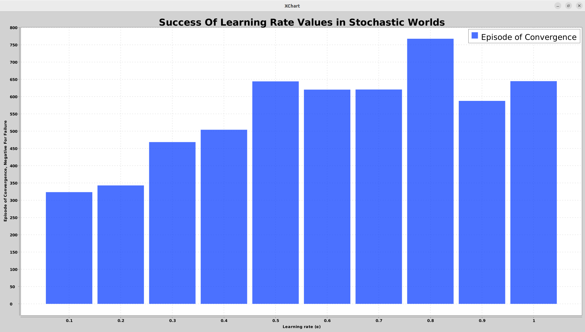
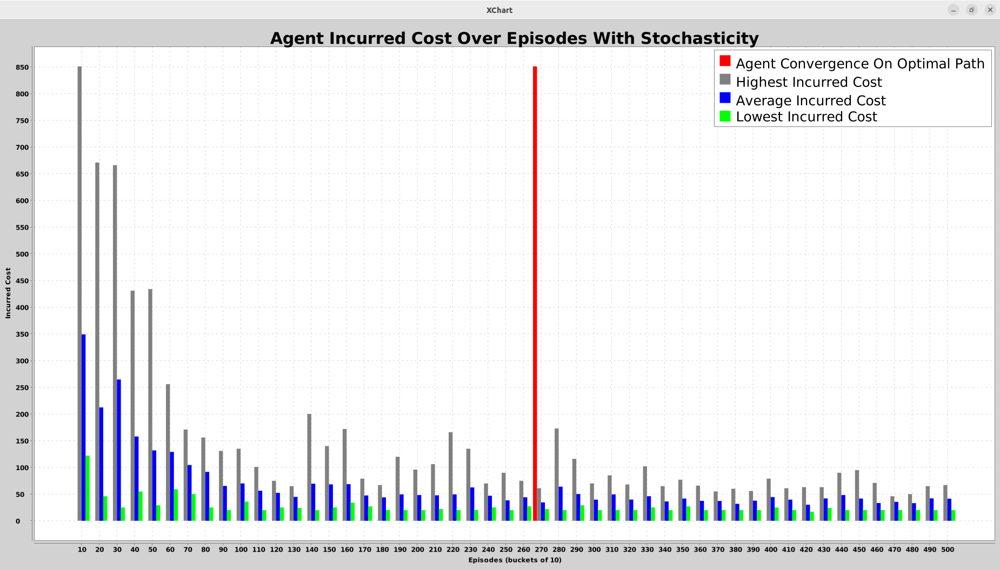

# Deep Dive Final Report: Q-Learning For Stochastic Environment Navigation

## Introduction to Q-Learning

### Q-Learning as Reinforcement Learning

Q-Learning is an algorithm that falls under the umbrella of Reinforcement Learning (RL).

In RL, decision-making "agents" learn to achieve some desirable goal in their environment while avoiding costly penalties. The agent has a set of actions it can take; depending on the state that the agent is in, those actions will result in different costs. For example, moving to the left is rewarding for the agent if it is to the right of its goal, but that same action is very costly if the agent is instead to the right of a cliff! The agent repeats this process over and over, with each iteration described as an "episode". After several episodes, the agent will have learned an optimal action sequence for achieving its goal with minimal cost.

One important challenge in RL is the exploitation-exploration dilemma. This refers to idea that agents must balance exploitation, or choosing the best known action in a given state, with exploration, or trying a new action that could possibly be better. More exploration can lead to the discovery of a more optimal action sequence, but runs the risk of taking a long time to find it. Exploitation, on the other hand, results in the best action sequence known now, but it may horribly underperform compared to unknown action sequences.

Q-Learning follows the basic principles of RL in that the algorithm trains an agent by associating certain state-action pairs with their cost, also known as a Q-value (or quality value). However, the algorithm has some unique features that set it apart from other RL algorithms.

### The Q-Learning Algorithm

Q-Learning is special in that it is a model-free algorithm, meaning that it does not attempt to model the dynamics of the environment. For example, the Q-Learning algorithm has no prior knowledge that taking action $A_0$ in state $S_0$ leads to state $S_1$. It only tracks the Q-value associated with the state-action pair $\{S_0, A_0\}$. Q-values are stored in the Q-table, which stores and updates Q-values during the learning process. After several "episodes" of learning, the Q-table can be used to find the optimal (least costly) action sequence from the agent's starting state to its final goal state.

Q-values are updated by the algorithm using the following formula:

$$Q_{new}(S_t,A_t)=(1-\alpha)*Q(S_t,A_t)+α(R+γ*maxQ(S_{t+1}))$$

This formula is made up of three terms. The first term represents the weighted current Q-value, while the second term represents the weighted new Q-value. The key parameters in the formula have the following meanings:
- $R$ (reward)
    - Associated with some state-action pair $\{S_n, A_n\}$
    - Determined by model of the world
- $\alpha$ (learning rate)
  - Describes how quickly new information overwrites old information
  - High values converge quickly but can overshoot the global minimum (the most accurate Q-value)
  - Low values risk converging too slowly or getting stuck in local minima (inaccurate Q-values)
  - In deterministic (non-probabilistic/non-stochastic) models, $\alpha=1$ is optimal
- $\gamma$ (discount factor)
  - Describes how future rewards are valued in comparison to current rewards
  - High values make future rewards nearly as valuable to attain as the current reward
  - Low values make the algorithm greedier, i.e. prioritizing immediate rewards

The agent continually explores its environment, updating its Q-table, until it achieves its goal. This process is repeated for several episodes, after which the agent will have discovered an optimal action sequence for achieving its goal. This is just like other RL algorithms: maximizing a reward function by exploring an environment.

### Other Types of Machine Learning

RL is one of three main branches of machine learning; the others are supervised and unsupervised learning.

In supervised learning, the model is provided with a set of example inputs and their desired outputs, which it learns to associate and map. One example of a supervised learning algorithm is linear regression, in which a mathematical relationship (like a best-fit line) between the input set and output set is estimated.

In unsupervised learning, the model is provided with no examples of what the desired output is. Instead, it must find mathematical similarities between inputs and classify them independently. An example of an unsupervised learning algorithm is Principal Component Analysis, in which dominant eigenvalues representing important featured are extracted from each input and clustered based on similarities.

In cases where no datasets are available to train on, environments are complex, and/or the "right answer" isn't immediately obvious, RL outperforms other methods of machine learning. As a result, situations where the "answer" is an optimal sequence of actions rather than a label or classification can often be solved with an RL approach.

### Application in Robotics

Robots must often explore unknown, dynamic, and stochastic environments in order to find the best path forward and achieve a goal. While shortest path algorithms like A* or Dijkstra's algorithm are useful for planning in environments that are completely understood by the agent, they tend to fail without complete knowledge. RL, on the other hand, is excellent for learning to navigate an environment that is dynamic, stochastic, or otherwise unknown by the agent as it explores. In particular, Q-Learning is useful in this case when the robot may not know what state it will end up in after taking a certain action, but has the ability to measure that action's cost.

There are other methods of RL that can be used for robotic path planning. One example is the policy gradient method, in which the agent explicitly defines a policy for finding the optimal path forward and tunes that policy's parameters using gradient descent until the policy converges on an optimal solution. Another algorithm, Model Predictive Control, explicitly models the environment that the agent explores. Constraints provided by the environment then help to guide the agent's policy towards an optimal solution. Q-Learning is a valuable algorithm even in comparison to more complex methods, due to its simplicity and efficiency in static environments.

## Methodology

### Designing the Warehouse Environment Model

I used a standard, non-randomized warehouse environment model for all training attempts. The design is a simplified version of real-life warehouse layouts, with long parallel shelves obstructing the agent's movement. In addition to obstacles, several hazardous areas are present. I envisioned most lanes between shelves as hazardous due to high human foot traffic, plus one lane with reduced foot traffic, and a single hazardous tile in the northwestern corner that could be a spillage or littered area. The agent begins at the opposite end of a highly trafficked lane as the location of its goal.

The types of tiles on the warehouse floor map to costs and rewards that the agent receives for stepping on them. Empty tiles still incur a small cost, to discourage longer trips, but hazards are as costly as running into walls. Reaching the goal, meanwhile, is highly rewarding. It's worth noting that obstacles cannot be moved into, but the agent will still incur a cost by attempting to do so.
- $empty = -1.0$
- $hazard = -5.0$
- $goal = +100.0$
- $illegal \ move = -5.0$

For testing purposes, I also created a mini-warehouse environment model that took much less time to explore:

Going forward, all training data will have been taken on the full-sized warehouse.

### Deterministic and Stochastic Models

As I discovered in my preliminary research, Q-Learning is particularly useful in stochastic environments where the agent may not know what state it will end up in after taking a certain action, but has the ability to measure that action's cost. I therefore chose to design a stochastic environment model, in order to fully demonstrate the utility of Q-Learning.

In my initial deterministic model, any action the agent takes is executed correctly with complete certainty. However, this is a somewhat unrealistic assumption: real robots may get caught on corners, slip on water, or simply have motor issues that cause them to end up in an unexpected place. This assumption also does not challenge the Q-Learning agent fully, as all new information can be safely assumed to be accurate.

I decided to introduce uncertainty to the success of action execution to my model. In the new version, the environment model maintains a "slippage rate", which is the probability that the agent's chosen action will be expressed as a different action in the actual environment. For example, imagine that the agent at state $S_0$ attempts to perform action $A_0$, but "slips" (with some probability $p_{slippage}$) and instead performs action $A_1$. Consequently, the agent uses the reward produced by {${S_0,A_1}$} to calculate the Q-Value for {${S_0,A_0}$}. Mistakes and noisiness like this slow down the agent's attempt to converge on the optimal path to its goal.

I chose the following value for my environment's slippage rate, to represent a world that is mostly reliable to navigate:

- $p_{slippage}=0.30$

As I learned next, choosing intelligent values for the Q-Learning algorithm's parameters can speed up convergence, even in the face of uncertainty.

### Selecting Q-Learning Parameter Values

The two pre-selected parameters in the Q-Learning algorithm are the learning rate $\alpha$ and the discount factor $\gamma$.

The learning rate describes how quickly new information overwrites old information in the Q-Table. A high value places confidence in new information but can overshoot and miss the optimal solution, while a low value can be slow to converge on the optimal solution.

The discount factor describes the significance that Q-values of future actions hold when calculating the current Q-value. A high value encourages long-term thinking in the agent, while a low value results in greedier behavior.

I chose the following value for my agent's discount factor, as I wanted my agent to prioritize future success over minimizing current costs:

- $\gamma=0.99$

My choice of value for the learning rate depended on the stochasticity of my model. In a fully deterministic world, all new information is certainly perfect, and there is no reason for the learning rate to be less than 1:

- $\alpha_{deterministic}=1.0$

As I will show shortly, however, this version of the agent performed poorly when action success was uncertain. I chose to experimentally determine a learning rate value that converged on the optimal solution most quickly, even in a stochastic world:

- $\alpha_{stochastic}=0.1$

I will discuss how I reached this value and its impact in the Training Results section.

Guided by these values for learning rate and discount factor, my finalized Q-Learning agent prioritized long-term success and maintained some skepticism of new information as it learned to navigate the warehouse.

### Action Selection With an Epsilon-Greedy Policy

An important component of the agent that I didn't expect to explore was its method of selecting an action. The agent needed to find the optimal path to its goal, but without sufficiently exploring its environment first, it could miss key information and converge on a non-optimal solution. This is the exploration-exploitation dilemma that all RL algorithms must confront.

I decided to implement the Epsilon-Greedy policy to inform my agent's action selection policy. Under this policy, the agent chooses to "explore" (selecting an action randomly) rather than "exploit" (selecting the action with the best known Q-value) with some probability $\epsilon$. I chose to set this parameter to a high value initially, and decrease it over several episodes. This results in an agent that initially only explores, and shifts over time to include more and more exploitation in its strategy. I also chose to include a nonzero minimum parameter value, such that the agent never fully stopped exploring.

I chose the following parameters for my policy:
- $\epsilon_{initial}=1.0$
- $\epsilon_{minimum}=0.10$
- $decay\_rate=0.995$

These values resulted in the following decay over 500 episodes:

This graph shows the change probability over 500 episodes that the agent will choose to randomly explore with its action rather than exploiting the knowledge in its Q-table. The agent initially chooses to explore nearly constantly at first, but exponentially decays into an exploitation-forward strategy. Since the warehouse environment model I created isn't enormous, and the optimal path is not hard to find, an exponential shift to exploitation is valuable for speedy convergence.

## Training Results

### Practicing In the Deterministic World

I initially trained my agent with parameters $\alpha=0.0, \gamma=0.99$ over 500 total episodes in a deterministic warehouse environment with parameters $p_{slippage}=0.0$. The following graph describes the average cost the agent incurred while finding the goal tile, in sets of 10 episodes each:

In this graph, episodes are grouped in buckets of 10 on the x-axis. For each bucket, the average (blue), minimum (green), and maximum (gray) cost incurred to succeed is shown on the y-axis (cost is negative in the model, but is shown positive here for clarity). The red bar indicates the point at which the agent conclusively converges on the optimal path.

Initially, the agent incurs massive amounts of cost while attempting to reach the goal tile. This makes sense, given that the Epsilon-Greedy policy encourages the agent to near-exclusively explore during the first several episodes. As it gathers more data for the Q-table and shifts to an exploitation method, the agent's average incurred costs get better and better. Furthermore, the highest incurred costs of each bucket also decline significantly, meaning worst-case scenarios are eliminated as episodes progress. During this training session, the agent converged to the optimal path in the 350-360 bucket of episodes.

To help visualize the agent's improvement, I created this animated demonstration to show off the agent's performance on an example Episode 0:

And that same agent's performance after 499 more episodes of training:

### Struggling In the Stochastic World

After the deterministic training session, I upped the challenge by introducing stochasticity to the warehouse environment model. This time, I trained a new agent with parameters $\alpha=1.0, \gamma=0.99$ over 500 total episodes in a stochastic warehouse environment with parameters $p_{slippage}=0.3$. The following graph plots the same information as the prior one, but with data from the new training session:

As the graph shows, this agent has a much harder time locating the optimal path to its goal. Even after 500 episodes, it still has not converged on that solution. Additionally, after 500 episodes the agent is still incurring costs as high as -300 even as its average incurred cost has fallen below -100, implying that the agent is not finding consistent success at all.

This struggle is due to the agent's deeply naive learning rate, $\alpha=1.0$. With this learning rate, the agent completely replaces existing Q-values in the Q-table with incoming data, rather than weighting and summing both. As a result, whenever the agent "slips" and incurs an inaccurate cost for the action it performed in its current state, the false Q-value produced by that slippage ruins any accurate learning the agent may have experienced prior to the slip.

With a lower learning rate, the agent can derive a new Q-value from the current Q-value and the new Q-value by applying complementary weights to each. As a reminder, a very low learning rate represents deep skepticism of new information, while a very high learning rate represents an eagerness to replace old information (potentially perilously, as we have seen).

I decided to experimentally determine the best learning rate given the stochastic world my agent had trained in. I consider the "best" learning rate to be the value that converges most quickly on the optimal path. I found the following results;

In this graph, potential values for the learning rate $\alpha$ are present on the x-axis. For each value, the episode of convergence of an agent using that learning rate, averaged across 10 trials of 1000 episodes each, is shown on the y-axis. Intuitively, higher learning rates take longer to converge in a stochastic environment, as they overly trust incoming Q-values that are potentially faulty. Using this graph, I selected an update learning rate value for my agent:

- $\alpha=0.1$

### Improving In the Stochastic World

As a final test, I trained one last agent with parameters $\alpha=0.1, \gamma=0.99$ over 500 total episodes in a stochastic warehouse environment with parameters $p_{slippage}=0.3$. The following graph describes the average cost the agent incurred while finding the goal tile, in sets of 10 episodes each:

As the graph shows, this agent is significantly faster to converge at the optimal path, even in comparison to the agent acting in the deterministic world. Just like my parameter sweep of the learning rate $\alpha$ revealed experimentally, this agent converged about 100 episodes earlier than its deterministic predecessor. The wild inconsistency of success seen in the prior stochastic test is also nonpresent in this agent. This is because its low learning rate allows it to be skeptical of deviance from known Q-values, and encourages it to build up trust in Q-values if they are frequently seen.

## Conclusions

### Learning Goals

Through this project, I learned a great deal about the mathematical foundation and real-life application of the Q-Learning algorithm. By contextualizing my research into Q-Learning with additional research on other RL and ML algorithms, I was able to articulate why Q-Learning would be a good choice for the problem statement I created. Furthermore, by experimenting with parameters of the algorithm, I gained a strong familiarity with how they influence the behavior of a Q-Learning agent.

An unexpected benefit of this project was that I gained experience developing and working in a low-fidelity simulation environment. This is something I had wanted to explore for a long time, and this project gave me a chance to deeply understand why a robust simulator can improve the testing of a particular algorithm. I also challenged myself to write a robust codebase, complete with thorough unit testing and documentation, which saved me infinite time as I moved on to testing the algorithm itself.

### Handling Stochasticity

Through benchmarking, I confirmed that selecting a well-selected learning rate can lead an agent to fast success, even in the face of great uncertainty. I was surprised to learn that choosing such a learning rate can cause an agent in a stochastic world to even outperform an agent in a deterministic world. Because dealing with uncertainty is such a key part of any robotic system, I'm really glad I got the chance to explore the strengths and weaknesses of the Q-Learning algorithm in a stochastic world.

## Future Work

### Randomized and Dynamic Environment Models

I would like to further explore the potential of a complex environment model.

In the tests I ran for this project, my warehouse model was small, predictable, and static. If the warehouse were significantly bigger, or if its obstacles and hazards were randomized, the agent might take longer to converge upon the optimal solution. The problem would also be more realistic, as Q-Learning is best applied when the optimal solution isn't obvious.

I am particularly interested in modeling a dynamic warehouse, in which some obstacles are mobile. These could be humans, forklifts, or other moving features in a warehouse that take the agent by surprise. If these mobile obstacles had set movement patterns, I would be curious to learn what modifications to the algorithm could cause the agent to anticipate and circumvent them.

### Multiple Q-Learning Agents

Many robots, particularly in warehouse environments, work in communicative teams. I would be curious to see if multiple Q-Learning agents could converge more quickly on a positive outcome than one agent alone. For example, perhaps the primary agent is seeking to reach a goal tile, and a secondary agent explores the warehouse on its behalf to refine it's Q-table quickly. Or perhaps both agents have independent goals on the map, but choose to share information with each other about the map. I would be especially interested to experiment with agents that are forced to weigh future rewards for themselves against future rewards for their companions.
